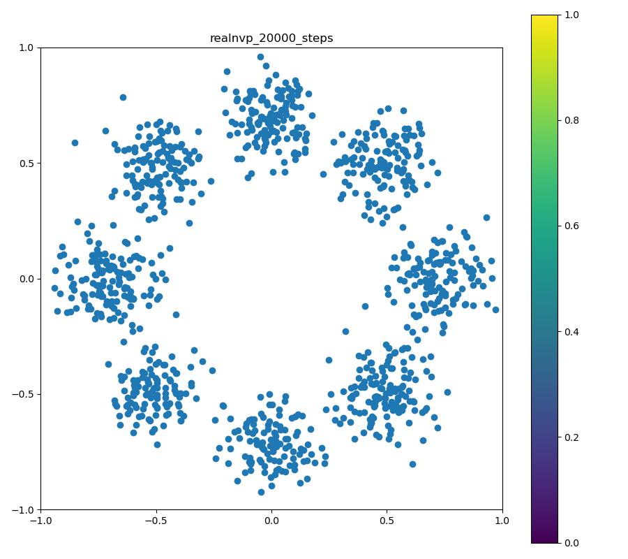
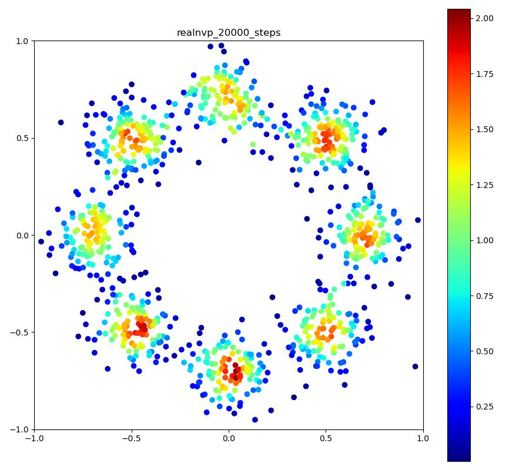
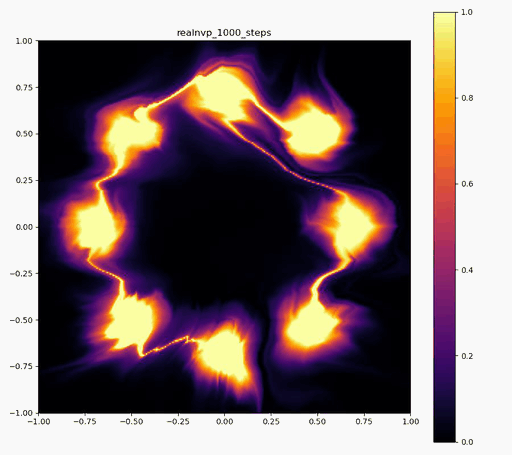

Normalizing Flows by PyTorch
===

[](https://www.codacy.com/gh/tatsy/normalizing-flows-pytorch/dashboard?utm_source=github.com&amp;utm_medium=referral&amp;utm_content=tatsy/normalizing-flows-pytorch&amp;utm_campaign=Badge_Grade)

> PyTorch implementations of the networks for normalizing flows.

Models
---

Currently, following networks are implemented.

* Planar flow
  * Rezende and Mohamed 2015, "Variational Inference with Normalizing Flows," [[arXiv]](https://arxiv.org/abs/1505.05770)
* RealNVP
  * Dinh et al., 2016, "Density Estimation using Real NVP," [[arXiv]](https://arxiv.org/abs/1605.08803)
* Glow
  * Kingma and Dhariwal 2018, "Glow: Generative Flow with Invertible 1x1 Convolutions," [[arXiv]](https://arxiv.org/abs/1807.03039v2) [[code]](https://github.com/openai/glow)
* Flow++
  * Ho et al., 2019, "Flow++: Improving Flow-Based Generative Models with Variational Dequantization and Architecture Design," [[arXiv]](https://arxiv.org/abs/1902.00275) [[code]](https://github.com/aravindsrinivas/flowpp)
* MAF
  * Papamakarios et al., 2017, “Masked Autoregressive Flow for Density Estimation,” [[arXiv]](https://arxiv.org/abs/1705.07057)
* Residual Flow
  * Behrmann et al., 2018, "Residual Flows for Invertible Generative Modeling," [[arXiv]](https://arxiv.org/abs/1906.02735) [[code]](https://github.com/rtqichen/residual-flows)
* FFJORD
  * Grathwohl et al., 2018, "FFJORD: Free-form Continuous Dynamics for Scalable Reversible Generative Models," [[arXiv]](https://arxiv.org/abs/1810.01367) [[code]](https://github.com/rtqichen/ffjord)

**Note:**
This repository is for easier understanding of the above networks. Therefore, you should use official source cods if provided.

Setup
---

### Anaconda

By Anaconda, you can easily setup the environment using `environment.yml`.

```shell
$ conda env create -f environment.yml
```

### Pip

If you use `pip` or other tools, see the dependencies in [`environment.yml`](./environment.yml)

Run
---

This repo uses `hydra` to manage hyper parameters in training and evaluation. See [`configs`](./configs) folder to check the parameters for each network.

```shell
$ python main.py \
    network=[planar, realnvp, glow, flow++, maf, resflow, ffjord]\
    train.distrib=[circles, moons, normals, swiss, s_curve, mnist, cifar10]
```

**Note:**
Currently, I tested the networks only for 2D density transformation. So, results for 3D densities (`swiss` and `s_curve`) and images (`mnist` and `cifar10`) could be what you expect.

Results
---

See [`results/README.md`](./results/README.md) for more results.

### Real NVP

| Target | Reproduced | Training |
|:--------:|:------------:|:----:|
|  |  |  |


Copyright
---

MIT License (c) 2020, Tatsuya Yatagawa
